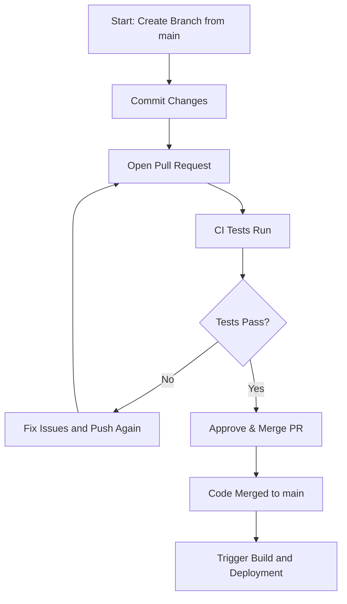
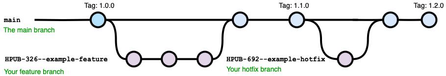
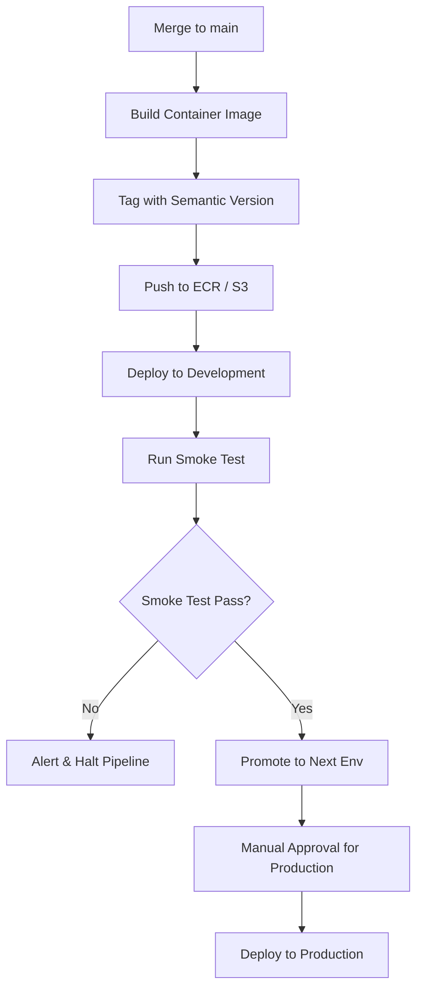

# Github Flow

We normally use Github Flow for application and Terraform-code containing repositories, meaning any code on the main branch must be production-ready. To ensure this:

    Automated tests must cover both new and existing code (regression tests).
    Feature gates are essential to prevent unfinished code from running in production.

## GitHub Flow Process

1. ### Create a Branch
   - Start a new feature or fix by branching off `main`.
   - There’s no special distinction between features, bug fixes, or hotfixes: they all follow the same workflow.

2. ### Work on the Branch
   - Make your changes and commit them.
   - Use `#major`, `#minor`, or `#patch` in commit messages to determine semantic versioning when merged to `main`.
     - If omitted, the default is a `#minor` bump (e.g., `1.2.3` → `1.3.0`).

3. ### Open a Pull Request (PR)
   - Open a PR to merge your branch into `main`.
   - This triggers automated tests and checks in the CI/CD pipeline.

4. ### Review & Approve
   - Team members review, suggest changes, and approve the PR.

5. ### Merge to `main`
   - Once approved, merge the PR.
   - Code in `main` is always production-ready.

6. ### Automatic Deployment
   - The pipeline builds, tests, and deploys the new code to the development environment.
   - If successful, it promotes the release through environments.
   - Unless you are very confident in your release pipeline, production deployment should always require manual approval.

This simple approach ensures that all changes  (new features, bug fixs, or urgent hotfixs) follow the same workflow, keeping deployments smooth and predictable.

## Pipeline Process

1. ### Pull Request (PR) Stage
   When a pull request is raised against `main`, the pipeline:
   - Runs unit tests
   - Builds a container image to validate functionality (the image is discarded after testing)

2. ### Merge to Main
   Once a PR is merged:
   - The container image is rebuilt
   - The image is tagged using semantic versioning (semver)
   - For container-based services, the image is pushed to an Amazon ECR repository (typically in the dev account, though this will be centralised in the future)
   - For Lambda functions, the artefact is pushed to an S3 bucket in each target account

3. ### Deployment to Development
   The image is automatically deployed to the development environment.  
   Basic automated tests run to verify that the deployment was successful.

4. ### Promotion to Next Environment
   If all tests pass, the image is promoted to the next environment.  
   If any test fails, the pipeline stops and requires investigation, a rollback, or a fix before continuing.

5. ### Production Deployment
   Deployment to production requires manual approval in GitHub Actions.  
   To approve:
   - Open GitHub Actions
   - Locate the relevant workflow run
   - Click "Review Deployments"
   - Approve the deployment to the production environment

## Repo Independence

Each repository is independent, meaning an environment may include different versions across services. For example the frontend of a service could be `v1.2.6` and the backend could be `v6.2.1`. This keeps versioning clear and decouples deployments.