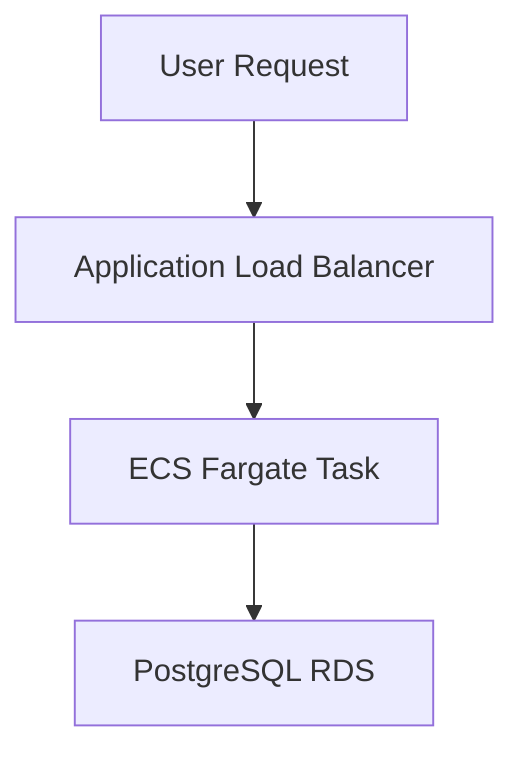
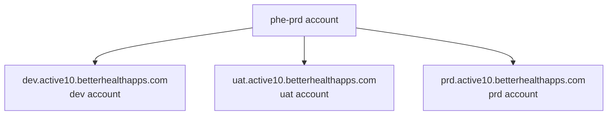

:warning: *Migration underway!*
> This application is currently being migrated to the new pipeline (as of 24 April 2025). The production environment is still using the old AWS account, so not all information below will apply until the migration is complete.

# Active10

Active10 is a mobile app used to anonymously record every minute of walking that a user does by tracking their steps. The mobile app connects to the API which consists of a loadbalancer, an ECS cluster and an RDS database cluster.
---

## Architecture Overview

---

## Components

### Application

- **Repo:** [talk-to-frank (Next.js app)](https://github.com/ukhsa-collaboration/active10-backend)
- The frontend application built with Next.js.

### Infrastructure as Code (IaC)

- **Repo:** [active10-infra](https://github.com/ukhsa-collaboration/active10-infra)
- Terraform code defining AWS infrastructure for all environments.

---

## Environments

| Environment | URL                                 | Notes |
|-------------|-------------------------------------|-------|
| **Production** | https://prd.active10.betterhealthapps.com/    | Protected by manual GitHub approval before deploy |
| **Staging**     | https://uat.active10.betterhealthapps.com/   | Auto-deploys |
| **Preview**     | https://dev.active10.betterhealthapps.com/   | First environment for testing new code |

---

## DNS Overview

The domain is registered in the phe-prd AWS account. The authoritative name servers (NS) are managed via a Route 53 hosted zone in that account. Subdomains are delegated as follows:

- dev.active10.betterhealthapps.com – Active10 Dev
- uat.active10.betterhealthapps.com – Active10 UAT
- prd.active10.betterhealthapps.com – Active10 Production

Each environment (account) manages its own hosted zone via Terraform.

If zones are recreated for any reason, the corresponding NS records must be updated in the phe-root account to point to the new name servers of the environment-specific hosted zone.