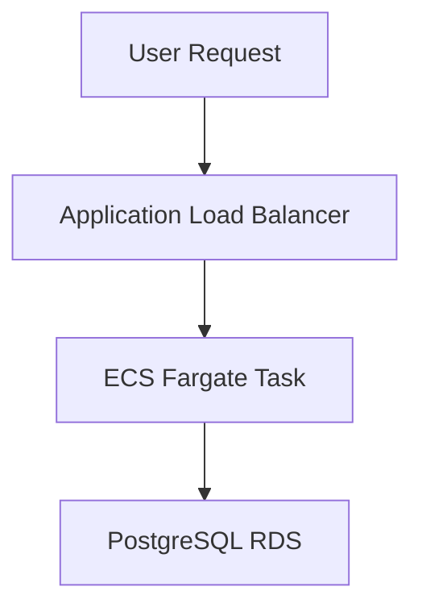
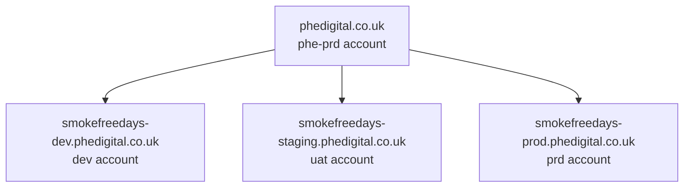

> :warning: *Migration underway!*
> This application is currently being migrated to the new pipeline (as of 24 April 2025). The production environment is still using the old AWS account, so not all information below will apply until the migration is complete.

# Smoke Free Days

Smoke Free Days (also known as the NHS Quit Smoking app) helps users track how long they have gone without smoking. The backend is deployed as a containerized service using Amazon ECS on Fargate.

## Architecture Overview

## DNS Overview

The domain is registered in the phe-prd AWS account. The authoritative name servers (NS) are managed via a Route 53 hosted zone in that account. Subdomains are delegated as follows:

smokefreedays-dev.phedigital.co.uk – SFD Dev
smokefreedays-staging.phedigital.co.uk – SFD Staging
smokefreedays-prod.phedigital.co.uk – SFD Production

Each environment (account) manages its own hosted zone via Terraform.

If zones are recreated for any reason, the corresponding NS records must be updated in the phe-root account to point to the new name servers of the environment-specific hosted zone.