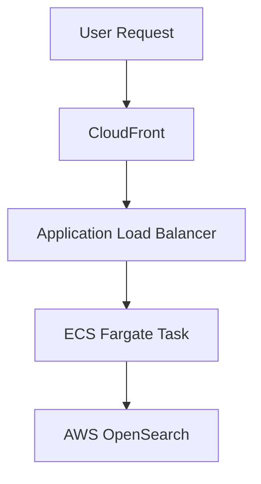
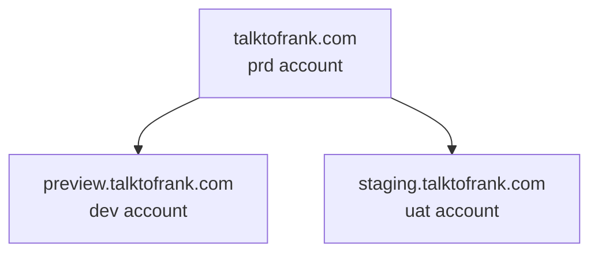

:warning: *Migration underway!*
> This application is currently being migrated to the new pipeline (as of 24 April 2025). The production environment is still using the old AWS account, so not all information below will apply until the migration is complete.

# Talk to Frank

Talk to Frank is a public-facing website offering drug advice for children and adults. It is deployed on AWS using ECS, behind a CloudFront distribution and an ALB, which routes traffic to ECS containers.

The site integrates with AWS OpenSearch (formerly Elasticsearch) to power its drug search functionality. The frontend uses the headless CMS [Contentful](https://www.contentful.com/) for its backend.

---

## Architecture Overview

---

## Components

### Application

- **Repo:** [talk-to-frank (Next.js app)](https://github.com/ukhsa-collaboration/talk-to-frank)
- The frontend application built with Next.js.

### Infrastructure as Code (IaC)

- **Repo:** [talk-to-frank-iac](https://github.com/ukhsa-collaboration/talk-to-frank-iac)
- Terraform code defining AWS infrastructure for all environments.

---

## Environments

| Environment | URL                                 | Notes |
|-------------|-------------------------------------|-------|
| **Production** | https://www.talktofrank.com        | Protected by manual GitHub approval before deploy |
| **Staging**     | https://staging.talktofrank.com   | Auto-deploys if preview tests pass |
| **Preview**     | https://preview.talktofrank.com   | First environment for testing new code |

---

## DNS Overview

The domain is registered with a third-party DNS registrar. The talktofrank.com domain is delegated to a Route 53 zone in AWS. This zone then delegates to the other accounts

- preview.talktofrank.com – TalktoFrank Dev
- staging.talktofrank.com – TalktoFrank UAT
- talktofrank.com – TalktoFrank Production

Each environment (account) manages its own hosted zone via Terraform.

If zones are recreated for any reason, the corresponding NS records must be updated in the phe-root account to point to the new name servers of the environment-specific hosted zone.