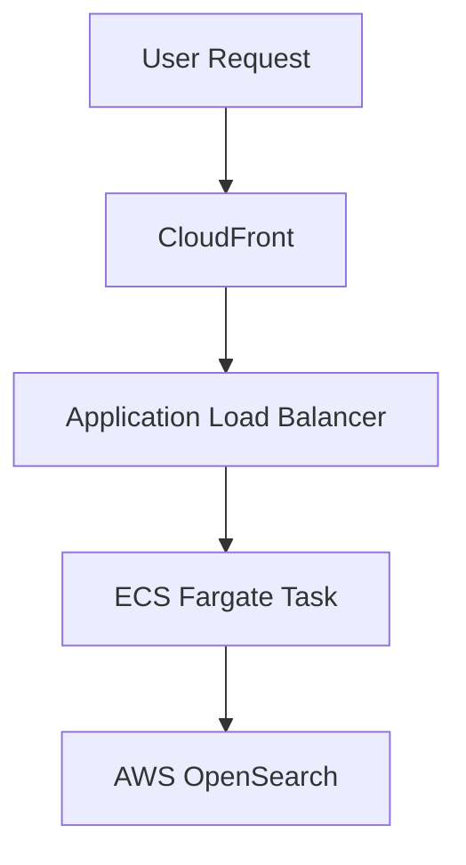
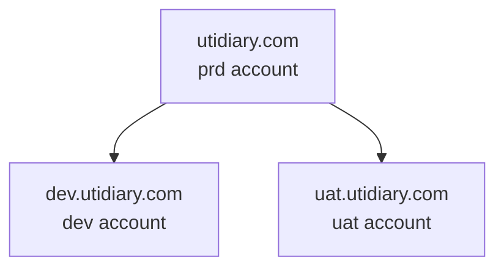

# UTI Diary

UTI Diary is a web application designed to help users track urinary tract infection (UTI) symptoms. It is currently in development and not yet live. Questions and user data are stored in a Postgres instance which runs on RDS.

---

## Architecture Overview

---

## Components

### Frontend

- **Repo:** [uti-diary-frontend](https://github.com/ukhsa-collaboration/uti-diary-frontend)  
- Built with TypeScript and provides the user-facing interface.

### Backend

- **Repo:** [uti-diary-backend](https://github.com/ukhsa-collaboration/uti-diary-backend)  
- A Django-based API consumed by the frontend.

### Infrastructure as Code (IaC)

- **Repo:** [uti-diary-iac](https://github.com/ukhsa-collaboration/uti-diary-iac)  
- Terraform configuration for deploying and managing infrastructure.

---

## Environments

| Environment   | URL                        | Notes                                                   |
|---------------|----------------------------|---------------------------------------------------------|
| **Production** | https://utidiary.com        | Requires manual GitHub approval before deployment       |
| **UAT**     | https://uat.utidiary.com   | Automatically deployed on merge to main after dev                 |
| **Development**     | https://dev.utidiary.com   | First environment new code is deployed to when it is merged to main  |

---

## DNS Overview

The domain is registered in the phe-prd AWS account. The name servers are assigned to the UTI Diary production account. Each account manages its own zone through Terraform.

dev.utidiary.com – UTI Diary Dev
uat.utidiary.com – UTI Diary UAT
utidiary.com – UTI Diary Production

